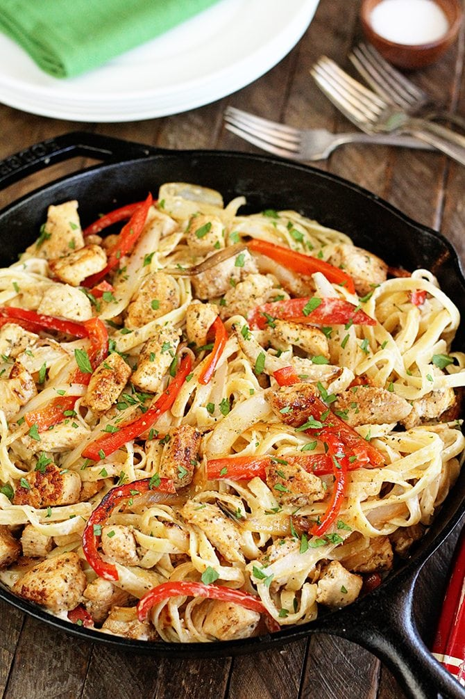

# Cajun Chicken Linguine

Servings: 4

## Ingredients

- 2 chicken breasts, sliced
- 2 tsp Cajun seasoning
- 2 tbsp butter
- 1 red pepper
- 1 green pepper
- 1 cup heavy cream

#### Seasoning Mix
- 1/4 tsp basil
- 1/4 tsp salt
- 1/8 tsp black pepper
- 1/4 tsp lemon pepper
- 1/8 tsp garlic powder

## Directions
1. Coat sliced chicken with Cajun seasoning
2. Saute chicken in butter
3. Saute peppers and onion
4. Simmer with cream and seasoning mix
