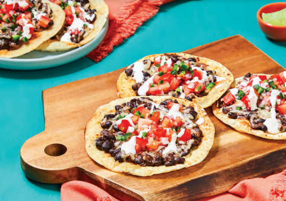

# Black Bean & Pepper Jack Tostadas

Servings: 4

## Ingredients

- 2 Roma tomatoes  
- 2 Red onions  
- 1 lime  
- 1 jalepeno  
- minced garlic
- sour cream  
- southweat spice miz  
- 2 cans black beans  
- Veggie stock concentrate  
- Tortillas  
- Shredded pepper jack cheese

## Directions

#### Spicy Pico De Gallo
Chop onions, tomatoes, and jalepeno. Combine into bowl. Add lime juice and salt and pepper

#### Crema
In a separate bowl, combine sour cream, 1/2 tsp southwest spice, salt and pepper, and a bit of lime juice. Add water until drizzly

#### Tostadas
1. Preheat oven to **`450 degrees`**.

2. Melt 2 Tbsp of butter in a pan. Saute onions. Stir in garlic and southwest spice. 

3. Stir in beans and their liquid, stock concentrate, and 1/4 cup water. Bring to a simmer. Stir and mash until mixture is thick and creamy (4-5 min). 
  
4. Brush tortillas with oil. Arrange on baking sheet and toast in oven. Flip halfway through baking. 

5. Spread beans on tortills and top with cheese. Melt in oven (2-3 min). 

Assemble and enjoy. 