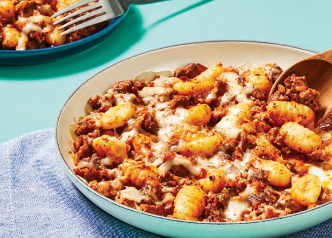

# Italian Pork Sausage Gnocchi Bake

Servings: 4

## Ingredients

- 2 yellow onions
- 2 roma tomatoes
- 2 pork sausages
- Italian seasoning
- Tomato paste
- Cream cheese
- Gnocchi
- Shredded mozzarella

## Directions

1. Start boiling a pot of water.

2. Slice onions. Cook onions 4-5 minutes in oiled pan until soft.

3. Add sausage, garlic, and Italian seasoning to pan. Cook 4-5 min until sausage is browned. Stir in diced tomato and tomato paste. Add salt and pepper. Cook 2-3 min. 

4. Add gnocchi to boiling water. Cook 3-4 minutes until tender. Set oven to broil.

5. Combine ¾ cup pasta cooking water, cream cheese, and 2 Tbsp butter into pan with sausage mixture until thoroughly combined. Add gnocchi.

6. Transfer to baking dish, sprinkle with mozzarella, and broil until cheese is browned (2-3 minutes).

 
     
   