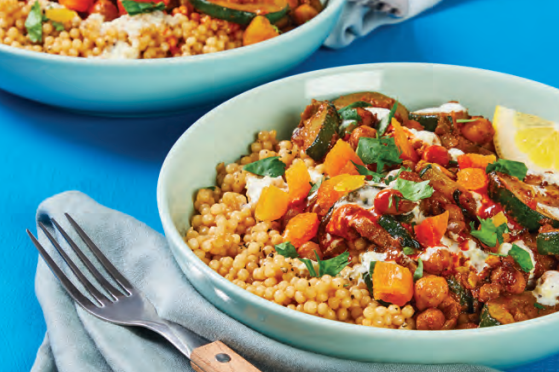

# Moraccan Chickpea & Apricot Tagine

Servings: 4

## Ingredients

- Israeli Couscous  
- Veggie stock concentrate  
- 2 cans chickpeas  
- 2 lemons  
- 2 Zucchinis  
- 2 yellow onions  
- Tunisian Spice Blend  
- Dried apricots  
- Minced Garlic
- Sour cream  
- Cilantro  
- Hot sauce

## Directions:

### Prep

- Zest lemon. Chop zucchini, onion, and cilantro. Drain chickpeas.

### Sauce

- Mix sour cream, lemon zest, pinch of garlic, and squeeze of lemon juice for sauce. 
- Add water until it reaches drizzling consistency.

### Couscous

- Cook couscous with 1 Tbsp garlic, 2 Tbsp butter, 1 ½ cups water, half the stock, and salt.
- Bring to boil then reduce heat. 
- Cook until tender (6-8 min) and drain. 

### Chickpea Mix

- Sauté zucchini and onion in pan. Add Tunisian spice and 1 Tbsp garlic.
- Add 2⁄3 cup water, rest of stock, and chickpeas to pan; simmer. 
- Stir in apricots, cilantro, 2 Tbsp butter, squeeze of lemon juice.

Serve couscous topped with chickpea mix and sauce. Serve with cilantro, apricots, and lemon wedges.