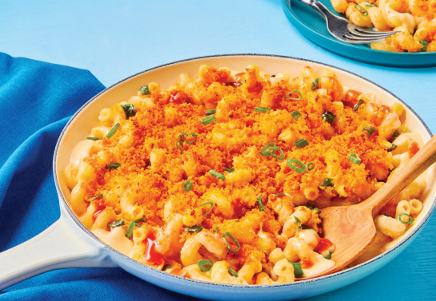

# Firehouse Mac N Cheese

Servings: 4

## Ingredients

- 2 green onions (scallions)
- 2 long green peppers  
- 2 tsp minced garlic
- Panko bread crumbs  
- Firehouse spice blend  
- Cavatappi pasta  
- Milk  
- Shredded cheddar  
- Shredded pepper jack  
- Hot sauce

## Directions

#### Pasta, Veggies, Seasoned Crumbs

1. Cook pasta. Save some cooking water.  
2. In an oiled pan, cook diced green pepper (4-5 min). Add diced scallion whites, garlic, and salt and pepper. Cook 1 min and transfer to plate.
3. Melt 2 Tbps butter. Stir in panko and Frank’s Seasoning. Set aside.

#### Cheese Sauce

1. Melt 2 Tbsp butter in pan. Whisk in 2 Tbsp flour until lightly browned (1-2 min). 
2. Slowly whisk in milk and bring to a simmer. Cook, whisking, until thickened, (2-3 min).
3. Whisk in cheddar and pepper jack until melted.

#### Assembly

1. Combine pasta, veggies, and cheese sauce into baking pan. (If needed, stir in splashes of pasta cooking water until everything is thoroughly coated in sauce.)
2. Sprinkle with seasoned panko. 
3. Broil until crust is golden brown (2-3 min).