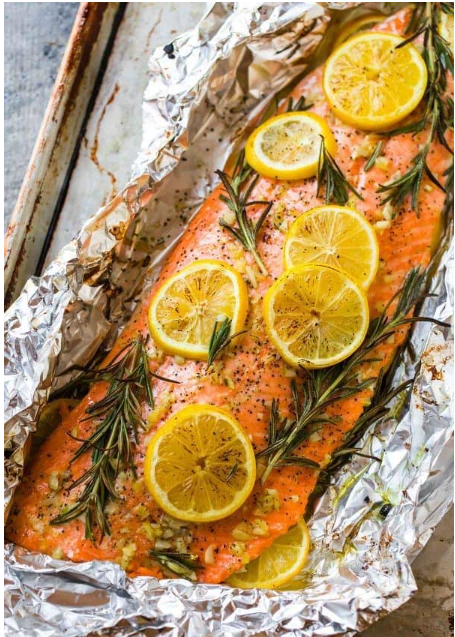

# Salmon

Servings: 4

## Ingredients

- Salmon fillet
- Butter
- Minced garlic
- Salt
- Pepper
- Rosemary
- 1 sliced onion
- 1 sliced lemon

## Directions

1. Place tin foil on cookie sheet, large enough so that tin foil will be able to completely wrap salmon
2. Melt 1-2 tbs butter. Coat salmon in melted butter.
3. Season with garlic, salt, pepper, rosemary.
4. Cover with lemon slices and onions.
5. Wrap in foil. Bake in oven at **`375 degrees for 10-20 mins`** or until temp probe reads **`145 degrees`** in the middle.

