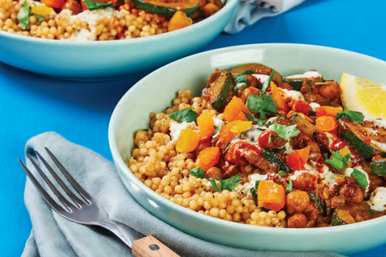

# Moraccan Chickpea & Apricot Tagine

Servings: 4

## Ingredients

- Israeli Couscous  
- 2 cans chickpeas  
- 2 lemons  
- Tunisian Spice Blend  
- 2 Zucchinis  
- Veggie stock concentrate  
- Dried apricots  
- 2 yellow onions  
- 6 cloves garlic  
- Sour cream  
- Cilantro  
- Hot sauce

## Directions:

1. Zest and quarter lemon. Finely chop garlic. Trim and halve zucchini lengthwise; cut crosswise into 1⁄2-inch-thick half-moons. Halve, peel, and dice onion. Drain and rinse chickpeas. Roughly chop cilantro.

2. In a small bowl, combine sour cream, lemon zest, a pinch of garlic, and a squeeze of lemon juice. Add water 1 tsp at a time until mixture reaches a drizzling consistency. Season with salt and pepper.

3. Melt 2 TBSP butter in a medium pot over medium-high heat. Add half the remaining garlic and cook until fragrant, 30 seconds. Stir in couscous to coat. Ad 1 ½ cups water, half the stock concentrates (you’ll use the rest later), and a big pinch of salt. Bring to a boil, then cover and reduce heat to low. Cook until couscous is tender, 6-8 minutes. Drain any excess liquid if necessary. Keep covered off heat.

4. While couscous cooks, heat a large drizzle of olive oil in a large pan over medium-high heat. Add zucchini and onion and season with salt and pepper. Cook, stirring, until softened and lightly browned, 7-10 minutes. Add Tunisian Spice and remaining garlic. Cook, stirring, until fragrant, 1 minute.

5. Stir 2⁄3 cup water and remaining stock concentrates into pan. Stir in chickpeas and bring to a simmer. Cook until liquid is slightly reduced, 1-2 minutes. Reduce heat to low, then stir in half the apricots (save the rest for serving), half the cilantro, 2 TBSP butter, and a squeeze of lemon juice until combined. Season with salt and pepper.

6. Season couscous with salt and pepper; divide between bowls. Top with chickpea mixture and creamy lemon sauce. Drizzle with hot sauce if desired. Sprinkle with remaining cilantro and apricots. Serve with remaining lemon wedges on the side.